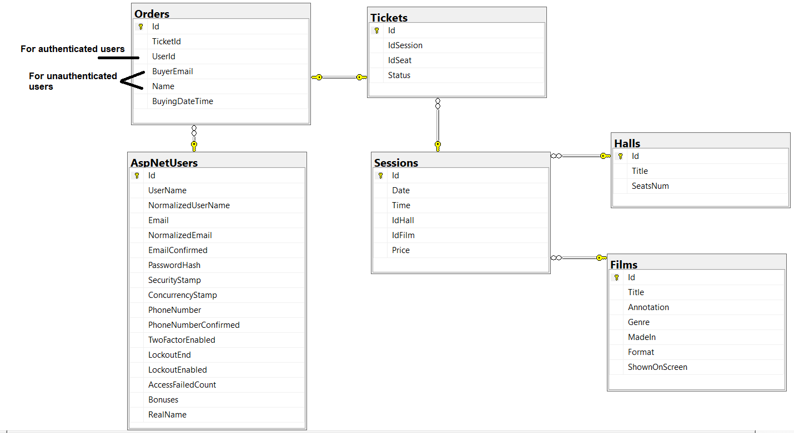
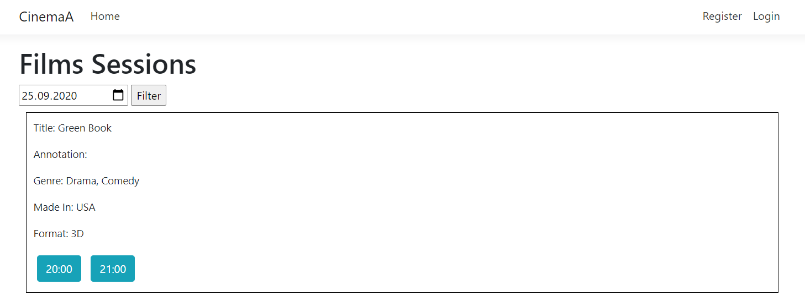
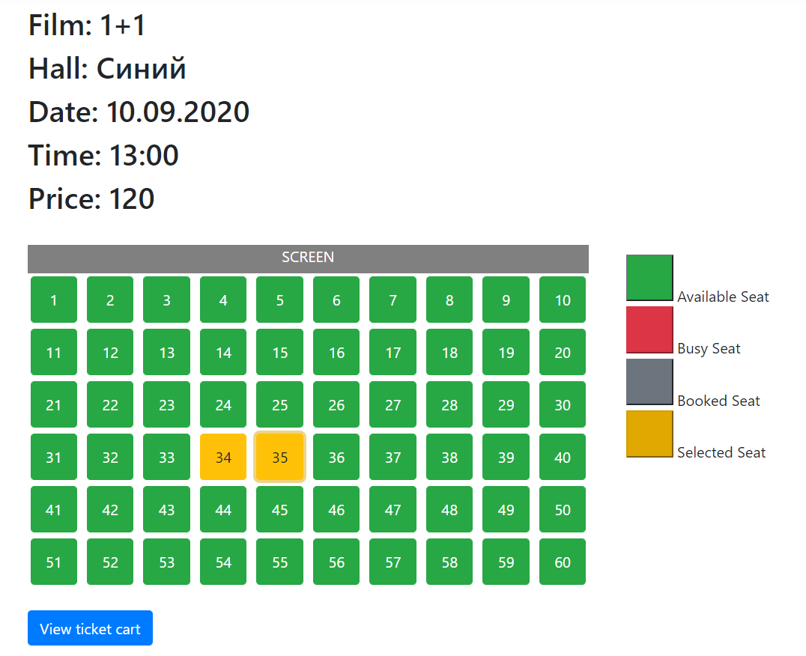
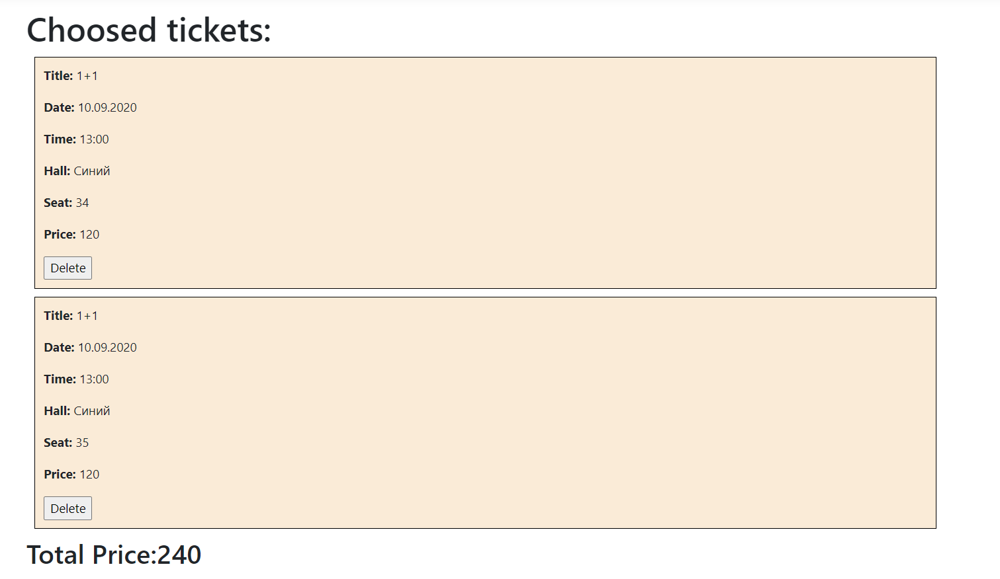
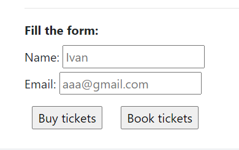
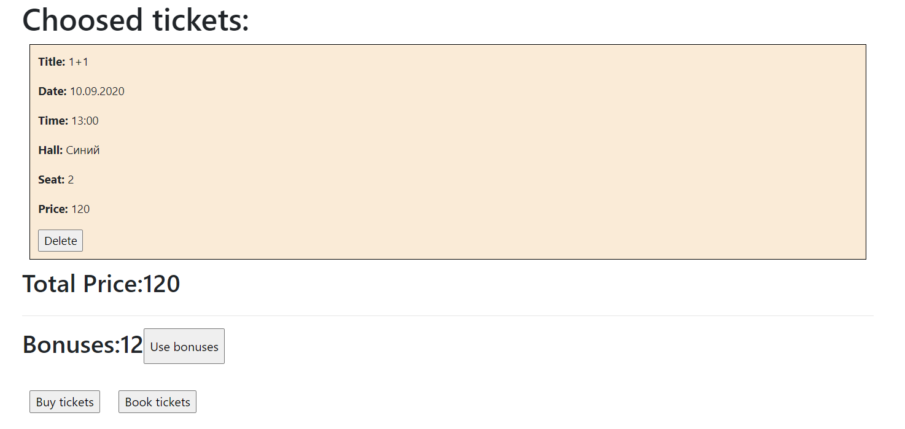
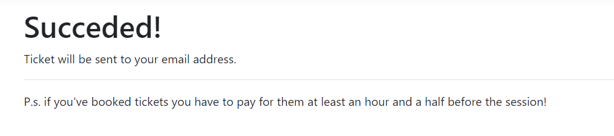
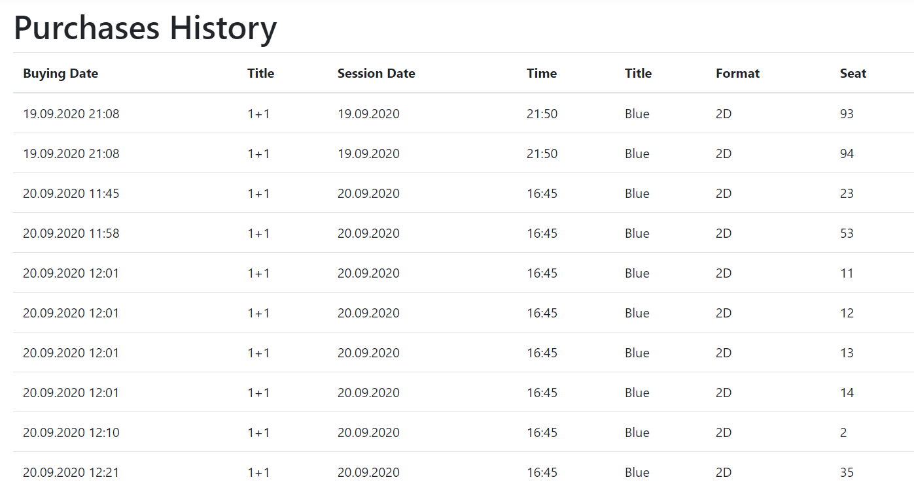

# Cinema
## Project goal
Implement a comfortable web-application for cinema, which will enable users to check an actual timetable of sessions and buy or book tickets online.
## Implemented functionality
1. Login or register in the application. There are two access levels: users and admins. Admins are added using ```AspNetUsers``` and ```AspNetUsersRoles``` tables, users using register form. 
2. See a list of sessions for a specific date.
3. See a scheme of seats for the session with notes which of them are free, bought or booked.
4. Buy or book a ticket for a specific session.
5. Bought and booked tickets are sent to user email.
6. If the user is authenticated, he is given a 10% cashback (bonuses) on his account, which can be spent in future purchases.
7. Authenticated user can see the history of purchases.
8. Admins can manage films, sessions, halls information using the application (create new, edit, delete, see details). Also they can create a set of sessions for a range of dates in one action or change film status (shown on screen or film screening is over).
## Installation and use features
1. To use the database, ```ConnectionStrings``` value in ```appsettings.json``` file must be changed to the actual ```CinemaADb.mdf``` file path.
``` 
"ConnectionStrings": {
    "DefaultConnection": "Data Source=(LocalDB)\\MSSQLLocalDB;AttachDbFilename=NEW_PATH_HERE;Integrated Security=True;Connect Timeout=30"
  }
  ```
2. For correct work of email sending, ```MailSettings``` value in ```appsettings.json``` file must be changed.
```
"MailSettings": {
    "Mail": "<from email>",
    "DisplayName": "<display name>",
    "Password": "<your password here>",
    "Host": "smtp.gmail.com",
    "Port": 587
  }
```
3. To create an account with admin role automatically, change ```AdminUserForTesting``` in ```appsettings.json``` file, set your email. Default password is 12345678, but you can change it also in this file.
```
"AdminUserForTesting": {
    "Email": "<your email here>",
    "RealName": "Testing User"
  },
  "DefaultPassword": "12345678"
```
### Some screenshots of the app
Database scheme:
Some screenshots of the web-site:
1) Main page where you can look through sessions for a specific date (by default current date is shown): 
2) Page where you can choose seats for a specific session: 
3) Ticket cart where you can see the total price, and fill the form to get the tickets (only if you are not authenticated): 
4) Ticket cart of authenticated user with ability to use personal bonuses: 
5) When tickets have been sent to user email sucess page is shown: 
6) Purchases history of authenticated user: 
