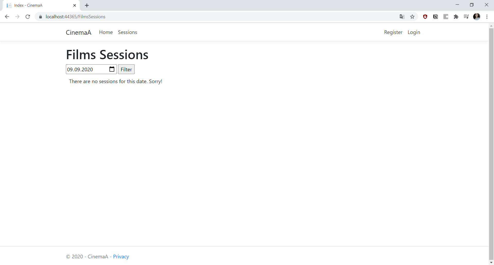

# Cinema
 ASP.NET Core project dedicated to online cinema tickets buying and booking. Main and improved project is CinemaA - authentication added, system of bonuses for registered users. 
1) This project uses MS SQL Server file as database (CinemaDb.mdf). This DB has insert trigger which add new Tickets to Tickets datatable when new Session added. For correct work of project change connection string in appsettings.json.
2) There are users and admins roles in project, to make user an admin add data to AspNetUsersRoles table. Admins have a few pages hidden from users (to create/change/delete films, sessions, halls of the cinema).
3) There is mail sending included to send bought or booked tickets to user's email, so to make it work correct, change "MailSettings" data in appsettings.json.

Some screenshots of the web-site:
1) Page where you can look through sessions for specific date (by default current date shown) 
2) Page where you can choose seats for specific session 
3) Ticket cart where you can see the total price, and fill the form to get the tickets - only if you are not authenticated(buying is simulated) 
4) Ticket cart of authenticated user with ability to use personal bonuses 
5) When tickets have been sent to user email sucess page is shown 
